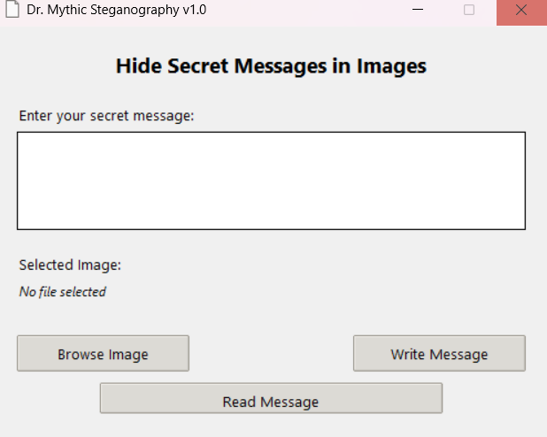

# Dr. Mythic Steganography

A simple and elegant desktop application for hiding secret messages within image files using steganography techniques. This application allows you to embed text messages into JPEG images without visibly altering the image, making it perfect for sharing secret messages securely.



## Features

- 🖼️ Support for JPEG/JPG image formats
- 📝 Hide text messages within images
- 🔍 Read hidden messages from images
- 🎨 Modern and user-friendly interface
- 🎯 Simple drag-and-drop file selection
- 💫 Centered windows and professional UI
- 🔒 Non-destructive to original image quality

## How It Works

The application uses a simple but effective technique to hide messages:
1. The message is appended to the end of the image file
2. Special markers are used to identify the hidden message
3. The image remains perfectly viewable in any image viewer
4. The message can only be read by those who know it's there

### From Source Code
If you prefer to run from source code or are using another operating system:

1. Clone this repository:
```bash
git clone https://github.com/Hambulance/JPEG-Steganography.git
cd JPEG-Steganography
```

2. Install required packages:
```bash
pip install Pillow
```

3. Run the application:
```bash
python steganography.py
```

## Usage

1. **Hide a Message**:
   - Click "Browse Image" to select a JPEG image
   - Enter your secret message in the text box
   - Click "Write Message" to hide the message in the image

2. **Read a Message**:
   - Click "Browse Image" to select an image with a hidden message
   - Click "Read Message" to view the hidden content
   - The message will appear in a new window

## Technical Details

The application uses a simple form of steganography by appending the message to the end of the JPEG file. This works because:
- JPEG viewers stop reading the file once they reach the end of the image data
- Additional data after the image content doesn't affect the image display
- The message is wrapped with unique markers for easy retrieval

## Security Note

This application is intended for educational and entertainment purposes. The steganography method used is basic and should not be relied upon for sensitive information. The hidden messages are not encrypted and can be found by anyone who knows to look for them.

## Contributing

Contributions are welcome! Please feel free to submit a Pull Request.

## License

This project is licensed under the MIT License - see the [LICENSE](LICENSE) file for details.

## Author

Created by Dr. Mythic

## Acknowledgments

- Thanks to the Python community for the excellent tkinter and Pillow libraries
- Inspired by the fascinating world of steganography and information hiding 
